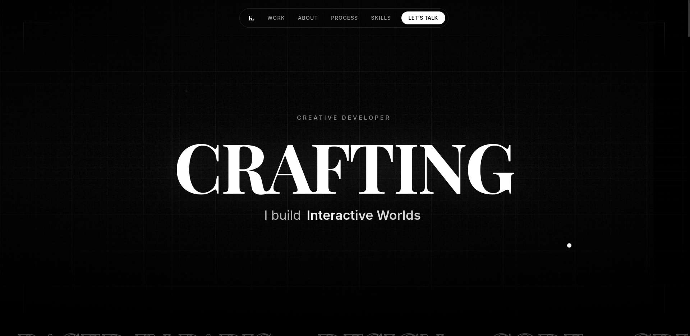
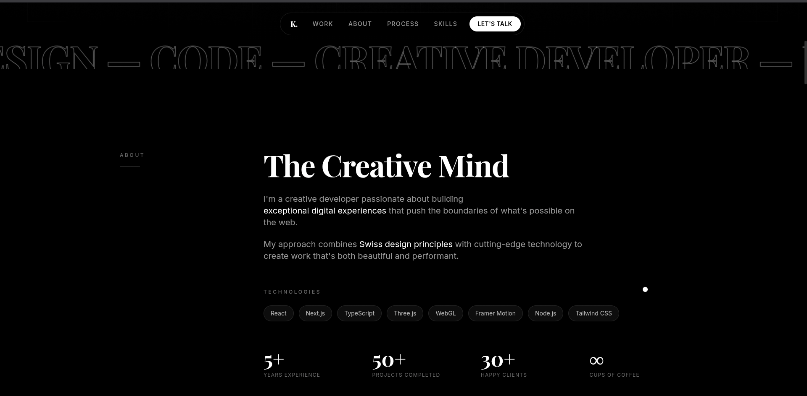
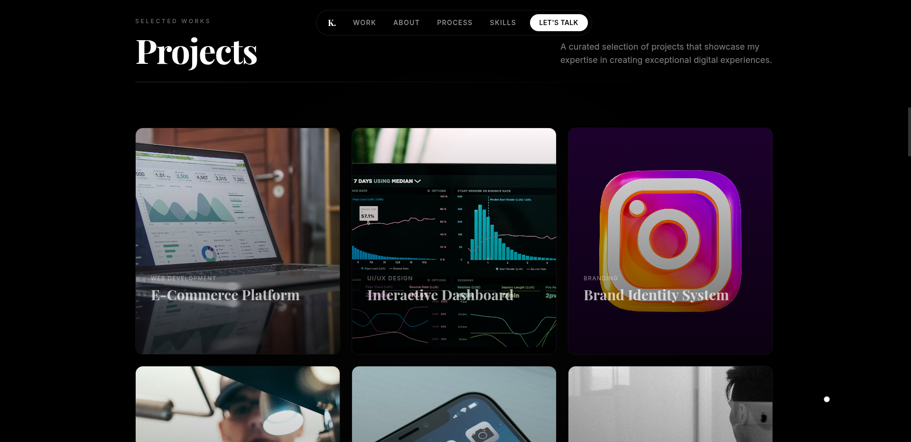
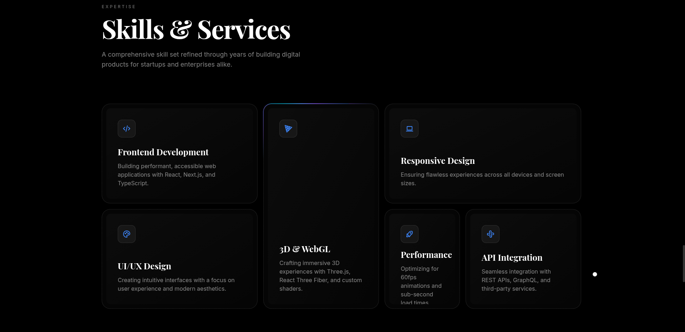
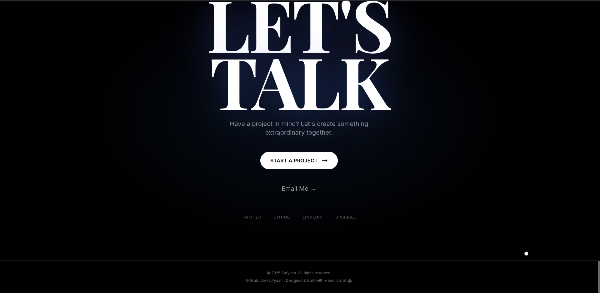

# Muhammad Anas Raheem — Portfolio

Personal portfolio site (Next.js 14 + Tailwind), adapted from the open-source **Pitch Black Swiss** template. It highlights AI and full-stack work, selected projects, experience, and skills.

## Live site

Deploy to your host (for example Vercel) and update the project URL in your README or environment as needed.

## Contact

- **Email:** anasraheem48@gmail.com  
- **Phone:** +92 346 244 0356  
- **Location:** Islamabad, Pakistan  
- **LinkedIn:** https://www.linkedin.com/in/anasraheem/  
- **GitHub:** https://github.com/anasraheemdev  
- **Website:** https://obrixlabs.com/

## Resume PDF

The footer **Download Resume** button points to `/resume.pdf`. Add your file at `public/resume.pdf` (the link will 404 until the file is there).

## Screenshots

Images in this repo:







## Portfolio chatbot (Groq)

A floating chat button answers **only** questions about Muhammad Anas Raheem. The API key stays on the server.

1. Copy `.env.example` to `.env.local`
2. Set `GROQ_API_KEY` from [console.groq.com](https://console.groq.com/)
3. Restart `npm run dev`

Never commit `.env.local` or paste API keys into chat or git.

## Local development

```bash
npm install
npm run dev
```

Open [http://localhost:3000](http://localhost:3000).

```bash
npm run build
npm start
```

## Tech stack

Next.js (App Router), React, TypeScript, Tailwind CSS, Lenis, Motion, Tabler Icons.

## Original template

Based on [Pitch Black Swiss / pitch-black-portfolio](https://github.com/dev-sufyaan/pitch-black-portfolio) by dev-sufyaan. All placeholder content in this fork has been replaced with Muhammad Anas Raheem’s information.

## License

See [LICENSE](LICENSE) (MIT, per upstream template unless you change it).
